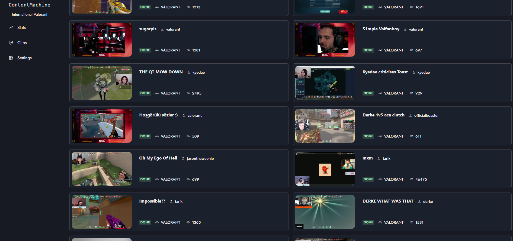
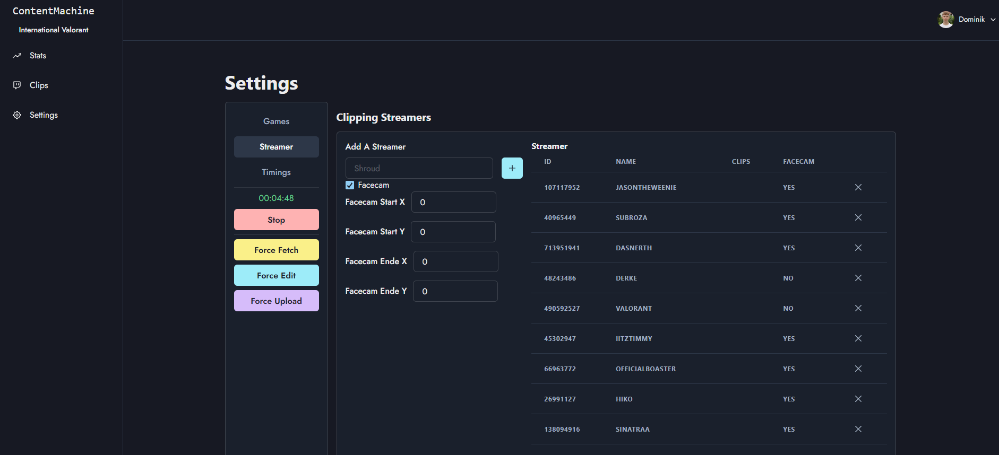
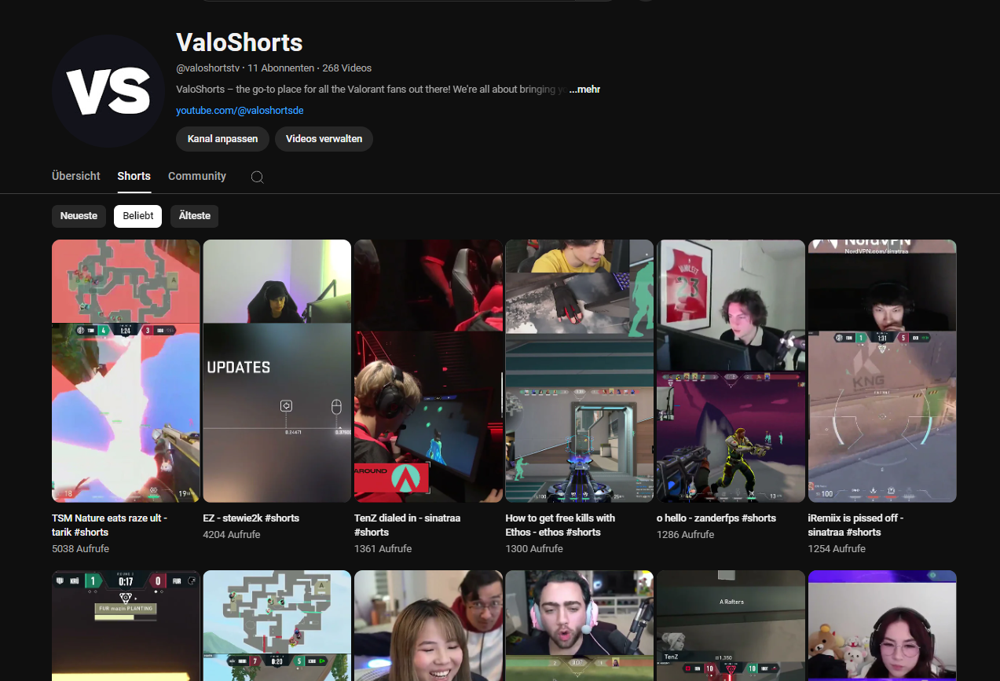
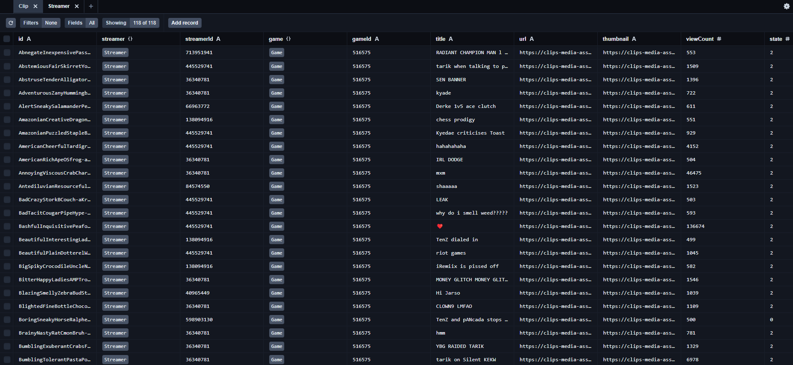

go [back](../../README.md)
# Content Machine

## Overview

Finds, downloads, edits and uploads the most recent popular Twitch.tv clips to YouTube shorts

## Features

- Web UI for managing the system
- Rest API for interacting with the system programmatically
- Twitch API to find popular clips
- FFMPEG to edit clips on a per creator basis
- A mix of the YouTube API and pupeteer magic to upload clips to YouTube

## Screenshots

### Web UI

### YouTube Channel

### Database

UI: Prisma Studio

