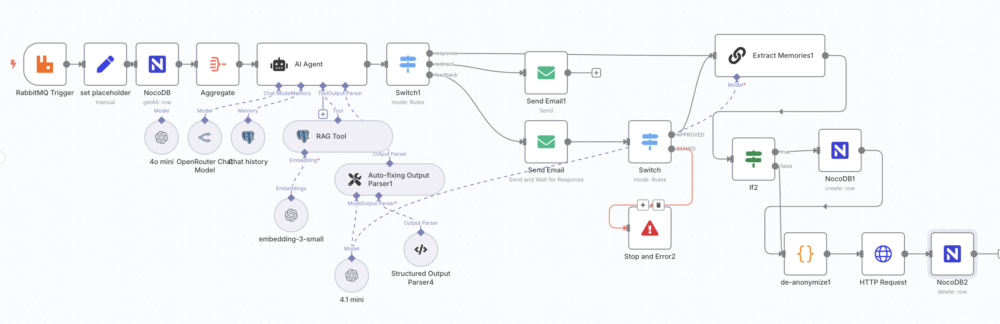

go [back](../../README.md)

# n8n workflows

## Concept for pushup.vision's chatbots

## E-Mail Tracking

Track E-Mails being opened once/multiple times

*E-Mails get sent with a 1x1px image src and it's database id*

*On GET request to the image src (which is a n8n webhook with the id as parameter), the email gets searched and set to opened/opened multiple times

## RAG AI-Agent

First version of pushup's chatbot in a single workflow

## Lead generation and enrichment

Find company leads & owner's contact data in germany with a single keyword

*scraping data off Google Maps*

*enrich data by finding out contact data*
