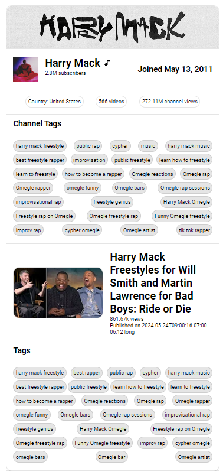

go [back](../../README.md)

# YouTube Info Extension

github repo: [github.com/centrixdev/youtube-info-extension](https://github.com/centrixdev/youtube-info-extension)

## Overview

Chrome extension that displays additional information about YouTube videos

## Features

- stats about the channel
- channel tags
- information about the video
- video tags

## Screenshots

